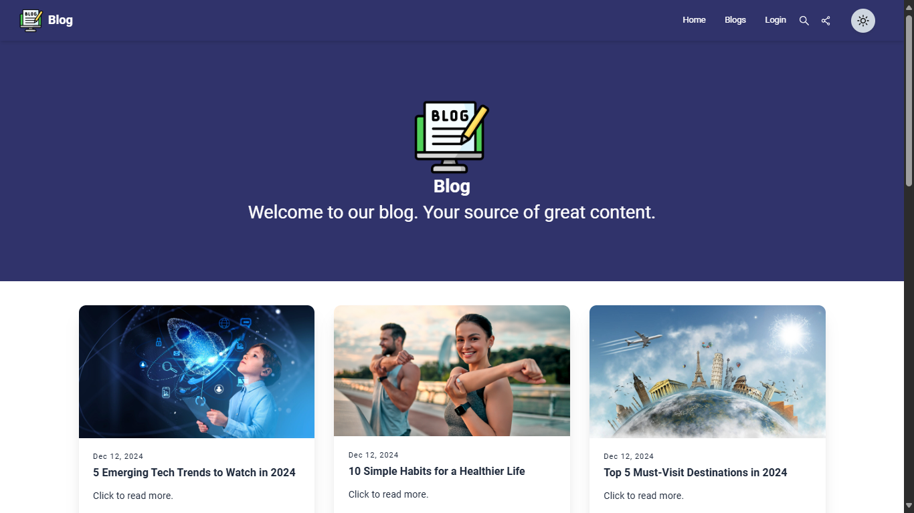
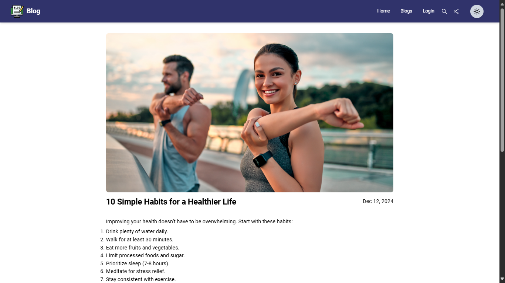
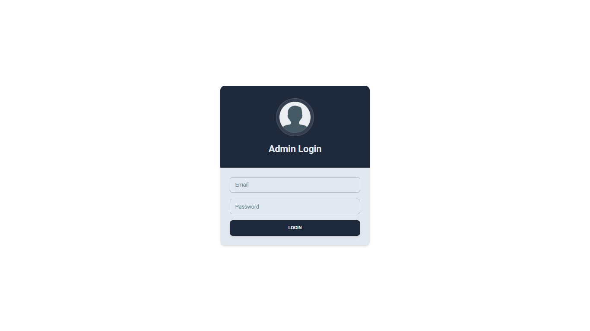

# Responsive Blog Website

Responsive Blog site project is developed using HTML, CSS, ReactJS, Firebase.
Talking about the project, it has lots of features. Admin can sign up and then sign in. Admin can add, edit, delete, and view their own blogs. A user can read blogs under different categories and search the post. Admin can add new blogs. Admin can add, edit and delete blogs for readers. This project is a complete blogging site for authors where posts are divided based on different categories. It contains a homepage from where users can check the latest blogs.

